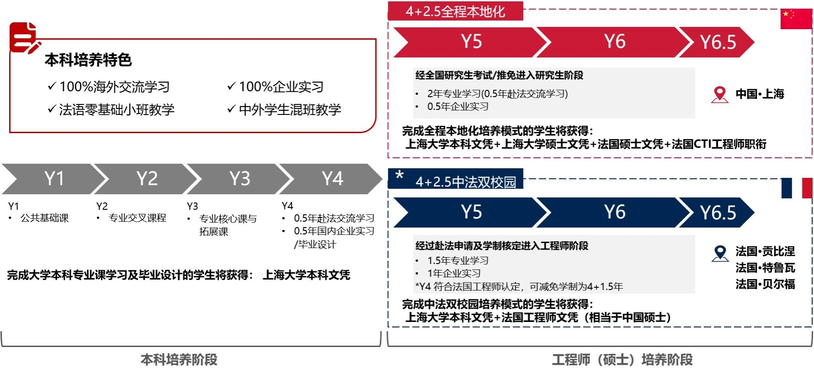

# 上海大学中欧生存指南

## 前言

---

## 介绍
学校和学院总是吹牛自己如何如何，我希望能在本章节结合我了解到的信息，让你了解到真实的上海大学中欧工程技术学院的情况。

[**上海大学**](https://www.shu.edu.cn/)：现在的上海大学实际成立于1994年，由多所学校合并而成（其中有一所也叫上海大学，成立于1983年）。至于学校宣传的“1922年成立”、“百年历史”指的是中国共产党主导创办并实际领导的第一所正规大学，也确实是叫上海大学，但于1927年被国民党当局强行关闭。现在的上海大学很难说是1922年上海大学的延续，在我看来不过是继承了一个名字。因此，上海大学其实是一所很年轻的学校，底蕴是有所缺乏的。综合各种排名，上大在国内虽然不是top211，但也至少是中上水平的211；上大的国际排名就很“吓人”了，在211里一骑绝尘，甚至超过了不少985。我们就不去讨论充没充钱了，这样的国际排名还是给学生在境外升学有很大优势。此外上海大学还是211中少有的综合类大学，文理工艺都还行但是又都没有特别突出的优势学科；理工科方面在第五轮学科评估中没有A类学科，但是有三个国家重点实验室。作为市属211，上海大学也还算有钱，但肯定还是比不上上科大。综上而言，上海大学就是这么一所“比上不足比下有余”的学校。当然地理位置还是相当优越的，说的是上海市，不是你——啥也没有的宝山区。

[**UT集团**](https://www.utc.fr/)：作为中欧学院的外方合作对象，法国UT集团贡比涅工程技术大学（UTC）、特鲁瓦工程技术大学（UTT）和贝尔福-蒙比利亚工程技术大学（UTBM）组成，都是法国的工程师学校（下面会有对于法国神秘的高等教育体系的介绍）。很显然，这是三所在国内完全名不见经传的学校，甚至你在四大世界排名的榜单上都几乎看不到它们。以其中公认的最好的学校UTC为例（后面会介绍到这里“最好”标准），截止到2026年1月25日，[qs](https://www.qschina.cn/en/universities/universite-de-technologie-de-compiegne-utc)无世界排名，工程技术学科排名为世界501-550；[THE](https://www.timeshighereducation.com/world-university-rankings/university-technology-compiegne)世界排名1201-1500；[USNEWS](https://www.usnews.com/education/best-global-universities/universite-de-technologie-de-compiegne-529344)世界排名1913；软科无国际排名。中欧的老师肯定会出来“辩护”：UT集团的学校都很小，国际排名肯定没有竞争力。好的，那我们拿出法国人自己排的国内工程师学校排名，还是以UTC为例，截止到2026年1月25日，[L'Etudiant](https://www.letudiant.fr/etudes/annuaire-enseignement-superieur/etablissement/etablissement-universite-de-technologie-de-compiegne-5895.html#classement-des-ecoles-d-ingenieurs)工程师全国排名29，五年制中排名6；[Le Figaro Etudiant](https://etudiant.lefigaro.fr/annuaire/13338-formations-des-ecoles-d-ingenieurs-formation-d-ingenieur-bac-5/#informations-classement)将三年制与五年制分开排名，五年制中排名2（这个排名经常会被拿出来证明排名高，但是千万不要被误导了，因为五年制的工程师学校比较少，厉害的学校大多是三年制的，后面会介绍），至于另外两所在这两个排名中都低于UTC，这也是我为什么说UTC是其中最好的原因。这时候，又有老师会说了：排名不重要，只要是工程师学校，在法国的就业就是很好。对于这种看法，没有客观的评价标准，我也就不“锐评”了。还有一个可以被称为诈骗的宣传：UTC是索邦大学旗下的。索邦大学（Sorbonne Université）是法国最好的大学之一，但事实是UTC隶属于[索邦大学集团](https://www.sorbonne-universite.fr/universite/alliance-sorbonne-universite/lalliance-de-tous-les-savoirs)（Alliance Sorbonne Université）而非索邦大学本身。总而言之，以国内视角，UT集团的三所学校可以被评为“野鸡”，在法国可能有一定声誉但不多。我实在是想不通为什么上海大学要找这么一个合作对象。大家可以参考其他211，例如西南交通大学与利兹大学，安徽大学与纽约州立大学石溪分校，甚至是上海大学的另一个中外合作项目与悉尼科技大学，而上海大学与UT集团就很难说是“门当互对”。

[**中欧工程技术学院**](https://utseus.shu.edu.cn/)：中欧学院成立于2005年，作为中外办学学院在上大内绝对是特别的存在：
- 最低的高考分数线：当然这也是进入上海大学这座211的最低的分数要求
- 边缘的地位：据我观察中欧学院人数不少但是地位在校内是相当没有存在感的，考虑到中外办学也情有可原，例如最低的保研率，奖学金名额也几乎是比例最少的
- 最多的学分要求：中欧拥有全校最多的学分要求，例如机械专业为317.5分，而大类普遍在两百多分，这主要是由于由大量的法语课
- 抽象的法语授课：抛开大量的法语课，大量专业课由法国老师用法语授课，而且给分方式完全不同于中方课。中方课按照**分数**以4.0，3.7，3.3，3.0，2.7，2.3，2.0，1.7，1.5，1.0，0给绩点，而法方课按照**排名**以4.0，3.0，2.0，1.5，1.0，0给绩点，这就导致中欧的绩点普遍都比较低。
- 相对高昂的学费：每年35000（我们老生是25000），但相比其他学校的中外合办的大几万还是十分便宜的

学院提供三种项目：
- 4+0：仅在上海大学完成本科四年，仅获得上海大学本科文凭
- 4+2.5中法双校园：在上海大学完成本科四年，在法国完成2.5年，可获得上海大学本科文凭+法国工程师文凭（大四完成半年海外交流学习及半年企业实习，满足法国工程认定，可减免学制为4+1.5年，[可参考](https://utseus.shu.edu.cn/info/1010/4306.htm)）
- 4+2.5全程本地化：法国高等教育体系：在上海大学完成本科四年以及硕士2.5年，可获得上海大学本科文凭+上海大学硕士文凭+法国硕士文凭+法国CTI工程师职衔（我不清楚法国CTI工程师职衔是否就是法国工程师文凭）

**法国高等教育体系**：在法国高考（BAC）后，高等教育分为两条路线：综合性大学（Universités）、精英学校（Grandes Écoles）。工程师学校（École d’ingénieur）属于精英学校，其中三年制需经过两年的预科（CPGE）后参加全国竞考（Concours），五年制则直接在高考（BAC）后申请。工程师学校授予工程师学位（Diplôme d'Ingénieur），效力等同于硕士学位，但在法国高于硕士学位（由综合性大学或精英学校的硕士项目颁发）。因此从级别/难度来排名：三年制工程师学校>五年制工程师学校>综合性大学。UT集团的三所学校属于五年制工程师学校。

---

## 就读体验：该不该来？来了怎么样？

## 课程（机械）
### 大一
#### 1.高等数学（袁西英）

上大的高数我个人认为不是很难，尤其是中欧的比大类的《微积分》还更简单一点。

课程：
- [b站-山东财经大学 宋浩-高等数学](https://www.bilibili.com/video/BV1Eb411u7Fw/)
流传度最广的高数视频，不一定是讲的最好的，但至少能听懂。

参考书/教材/习题册：
- [《普林斯顿微积分读本》-人民邮电出版社](https://detail.tmall.com/item.htm?id=542442529630)
- [《微积分习题册》-上海大学出版社](https://detail.tmall.com/item.htm?id=764925745207)
强烈建议作为期末复习多刷一刷，题型、难度和考试类似。

#### 2.工程制图与计算机绘图基础（沙凤龙）

课程：
- [b站-哈尔滨工业大学-画法几何及机械制图](https://www.bilibili.com/video/BV1up4y1C7y7)
- [b站-大连理工大学 王殿龙-画法几何及工程制图](https://www.bilibili.com/video/BV1nP411n73c/)

#### 3.大学物理（法方）
比较简单，用微积分把高中的运动学重新讲一遍。我记得没有力学的内容。可参考大类的《大物1力学》，本校老师录制的网课：

[b站-上海大学 张弘-大学物理（1）](https://space.bilibili.com/1532021508/lists/933419?type=season)

#### 4.算法入门（法方）

教程：
- [《Hello算法》](https://www.hello-algo.com/)
算法、数据结构可视化教程

---

### 大二
#### 1.机械制图A（林成辉）

#### 2.大学物理（贾蓉蓉、曾志刚）
《大物2》是电磁学，《大物3》是热学、光学和近代物理。

本校老师录制的网课：
- [b站-上海大学 张弘-大学物理（2）](https://space.bilibili.com/1532021508/lists/470015?type=season)
- [b站-上海大学 张弘-大学物理（3）](https://space.bilibili.com/1532021508/lists/729727?type=season)

其他课程：
- [b站-东北大学 大学物理](https://www.bilibili.com/video/BV1qW411H7UX/)

#### 3.CATIA三维造型设计（何岚岚）

#### 4.工程力学（罗柏华）

课程：
- [b站-大连理工大学 黄丽华-工程力学](https://www.bilibili.com/video/BV1Sk4y1r7Qz)

#### 5.线性代数（法方）

课程：
- [Youtube-MIT Gilbert Strang-18.06](https://www.youtube.com/watch?v=7UJ4CFRGd-U)
- [Youtube-3B1B-Essence of linear algebra](https://www.youtube.com/watch?v=fNk_zzaMoSs)
- [b站-UTC-Algèbre linéaire](https://www.bilibili.com/video/BV1cG411w7Gj/)
- [b站-阳明交通大学 周志成-线性代数](https://www.bilibili.com/video/BV1c14y1h7bd/)

参考书/教材：
- [《Introduction to Linear Algebra》-清华大学出版社](https://detail.tmall.com/item.htm?id=830377631797)
这本书是MIT18.06课程的教材，但好像一直没有中文版，只有民间自行翻译的版本，可自行查找。

#### 6.概率论与数理统计（陈伟）

课程：
- [b站-中国科学技术大学 缪柏其-数理统计](https://www.bilibili.com/video/BV1Zq4y1C7Bs/)

#### 7.机械原理（刘吉成）

---

### 大三
#### 1.机械设计（王亚珍、余光伟）

我已开源完整课程设计，包括设计说明书、装配图、零件图，详见仓库[GearboxDrawing](https://github.com/FrankYanhanSun/GearboxDrawing)。

课程：
- 理论：[b站-吉林大学 谭庆昌-机械设计](https://www.bilibili.com/video/BV1FW41127QB/)
- 作图：[b站-天上一白-机械设计课程设计](https://www.bilibili.com/video/BV1A44y197Hb/)

参考书：
- [《机械设计课程设计（第6版）》-机械工业出版社](https://item.taobao.com/item.htm?id=691022636697)
推荐将本书作为课程设计的参考，流程、标准都很详细

#### 2.机械系统的运动学和动力学（法方）
这门课其实就是国内理论力学中的内容，但是中欧的理论力学没有介绍完整，把一些内容放在的这门课。法方的内容全部围绕Torseur这个内容展开，与国内体系很不一样。

课程：
- [b站-河海大学 楼力律-理论力学](https://www.bilibili.com/video/BV1pysRzMELy/)

#### 3.项目管理（法方）

务必认真完成所有TD以及小组作业，可参考[往届作业](https://onedrive.live.com/?id=79D667688CF2FB05%2168237&cid=79D667688CF2FB05&redeem=aHR0cHM6Ly8xZHJ2Lm1zL2YvYy83OWQ2Njc2ODhjZjJmYjA1L0VnWDc4b3hvWjlZZ2dIbU5DZ0VBQUFBQnpXT0dfMzc4VFUxQWhOSjZ1cVp4RXc)。

复习课：
- [b站-上海大学 许婧靓-项目管理复习课](https://www.bilibili.com/video/BV11a4y1Q7ww/)

#### 4.工程化学（王晓红）

---

### 通识课/文科课/实习

---

### 选修课
#### 1.微机原理及应用（张震）

课程：
- [b站-天津科技大学 孙涌-单片机原理及应用](https://www.bilibili.com/video/BV1te4y1y7n7/)

#### 2.机器人工学（宋薇）

课程（运动学）：
- [b站-台湾大学 林沛群-机器人运动学](https://www.bilibili.com/video/BV1oa4y1v7TY/)

#### 3.机械CAD/CAM（李宝福）

课程：
- [b站-杜术森-Creo软件从入门到精通](https://www.bilibili.com/video/BV1HY4y1q76Q)

#### 4.C语言程序设计（邹启明）

课程：
- [b站-C语言鹏哥](https://www.bilibili.com/video/BV1Vm4y1r7Yy/)

#### 5.电子技术B（邓丽）
本课程考试形式为半开卷，我已开源“大抄”[Half-open_Exam_Note](https://github.com/FrankYanhanSun/Half-open_Exam_Note)。

课程：
- [b站-哈尔滨工业大学 姜三勇-电工学](https://www.bilibili.com/video/BV1et411z7Nz/)

---

## 课外学习
### 课程
这里收录一些我自学过以及我想学的公开课程，也希望能对大家有所帮助。

- [b站-南京大学 王慧妍-ICS2024](https://www.bilibili.com/video/BV11BpFe4EmM)
- [b站-一只学弱狗-嵌入式C语言](https://www.bilibili.com/video/BV1RW411G7cr)
- [b站-西湖大学 赵世钰-强化学习的数学原理](https://www.bilibili.com/video/BV1sd4y167NS/)
- [b站-普中科技-Arduino（ESP32）](https://www.bilibili.com/video/BV1Pw4m1D7Ge/)
- [b站-keysking-STM32入门教程（HAL库）](https://www.bilibili.com/video/BV12v4y1y7uV)
- [b站-江协科技-STM32入门教程（标准库）](https://www.bilibili.com/video/BV1th411z7sn/)
- [b站-Expert电子实验室-PCB设计（嘉立创EDA）](https://www.bilibili.com/video/BV1fFAfeZEBE/)
- [b站/公众号-数学建模清风-数学建模](https://space.bilibili.com/52614961)
- [b站-同济子豪兄-YOLO](https://www.bilibili.com/video/BV15w411Z7LG/)
- [Youtube-Northwestern Kevin Lynch-Modern Robotics](https://www.youtube.com/watch?v=jVu-Hijns70)
- [b站-UCSB 闫令琪-GAMES101 现代计算机图形学入门](https://www.bilibili.com/video/BV1X7411F744/)
- [b站-上海交通大学 何建平-现代控制理论](https://www.bilibili.com/video/BV1fHZKYNEaM/)
- [b站-CMU Guanya Shi-16-831 Introduction to Robot Learning](https://www.bilibili.com/video/BV1RWGqzyEYh?vd_source=a416fcb6c88258170a1902d8753f0269&spm_id_from=333.788.videopod.episodes) ([link](https://16-831.github.io/spring25/))

### 竞赛
- 数学建模：国赛/美赛
- RoboMaster
- 工创赛
- 睿抗
- 机创
- 画图

### 科研/实习

---

## 未来去向：升学/就职

## 生活

## 乱七八糟